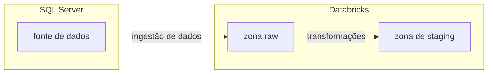
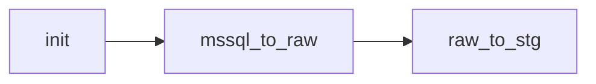

# Desafio final - Programa Lighthouse

Este repositório contém o projeto resultante do desafio final da trilha de engenharia de dados do Programa Lighthouse, desenvolvido pelo aluno Bruno Gustavo Vieira.

O projeto é constituído de um fluxo de ingestão de dados, construído como um job do Databricks, assim como da infraestrutura necessária para a execução deste job.

A infraestrutura é provisionada por um [asset bundle](https://docs.databricks.com/en/dev-tools/bundles/index.html) do Databricks e um projeto Terraform.

## Pipeline

A fonte de dados é o banco [AdventureWorks](https://learn.microsoft.com/en-us/sql/samples/adventureworks-install-configure?view=sql-server-ver16&tabs=ssms), hospedado em um SQL Server remoto. Os dados da camada *sales* devem ser movidos para uma **zona raw** e uma **zona de staging** no workspace do Databricks fornecido, com as devidas tranformações sendo aplicadas entre estas duas camadas.



O fluxo se classifica como uma pipeline EL, pois o carregamento dos dados para a fonte (Databricks) ocorre antes de transformações serem aplicadas. Conforme representado no fluxograma acima, podemo distinguir três camadas:

**1. Fonte de dados:** Contém os dados originais a serem carregados no Databricks.

**2. Zona raw:** A primeira camada de dados carregados no Databricks. Contém dados idênticos, ou tão próximos quanto o possível, àqueles extraídos da fonte. 

**3. Zona de staging:** Contém dados com transformações leves, a fim de proporcionar uma base segura para posteriores modelagem e análise.

## Job do Databricks

Na prática, a pipeline é executada pelo job do Databricks **bruno_vieira_adw_job**, que possui a seguinte estrutura de tasks:



### init
 Inicializa o job, criando (caso ainda não existam) esquemas e tabelas necessários para sua execução, e também populando tabelas com registros iniciais.

### mssql_to_raw
Move os dados da fonte para a zona raw. Os dados da zona raw devem ser carregados em um catálogo exclusivo no Unity Catalog, definido pelo parâmetro **raw_catalog_name** do job. Por padrão, será utilizado o catálogo **bruno_vieira_raw**.

### raw_to_stg

Move os dados da zona raw para a zona de staging, aplicando transformações quando necessário. Assim como com a zona raw, esses dados devem ser carregados em um catálogo *exclusivo e diferente do primeiro*, definido pelo parâmetro **stg_catalog_name**. Por padrão, será utilizado  o catálogo **bruno_vieira_stg**.

*Todas as tabelas* serão submetidas a pelo menos um processo de transformação: os nomes das colunas serão conformados para a convenção de nomenclatura *snake_case*, afim de se assegurar essa padronização na base de staging. Esta transformação é aplicada programaticamente a todas as tabelas ingeridas e portanto não é necessário nenhum passo adicional ao incluir novas tabelas no **controle de ingestão**.

Outra transformação que será aplicada automaticamente às tabelas é a renomeação das colunas que formam sua chave primária para os nomes definidos na coluna **stg_primary_key** do [controle de ingestão](#ingestion-control), *caso esta coluna não seja nula*.

Para aplicar demais transformações, tais como renomeações de colunas, conversões de tipos, entre outras, seguir as instruções descritas no notebook **raw_to_stg.ipynb**. 

## Parâmetros do job
É possível [executar o job com parâmetros personalizados](#run-job-instructions). Isto será útil em diferentes situações, como por exemplo para executar a pipeline com uma *run_date* diferente da data atual, ou para guardar os dados ingeridos em catálogos diferentes dos de produção em um cenário de depuração.

| Parâmetro | Descrição | 
| ------------ | -------- | 
| ctr_catalog_name | Nome do catálogo da zona de controle. | 
| raw_catalog_name | Nome do catálogo da zona raw. |
| stg_catalog_name | Nome do catálogo da zona de staging. | 
| mssql_host | Host do SQL Server. | 
| mssql_port | Porta do SQL Server. | 
| secret_scope | O escopo dos segredos do Databricks. |
| run_date | A data de execução, em formato ISO. As tabelas com carga incremental serão carregados a partir do **dia anterior** à data fornecida. Por padrão, recebe o valor da data atual. | 
| managed_location | O caminho do local de armazenamento gerenciado. | 

## Secrets

É necessária a definição de alguns segredos do Databricks, no escopo definido pelo parâmetro **secret_scope** do job.

| Secret | Descrição |
| -------- | --------- |
| mssql_username | Usuário do banco SQL Server
| mssql_password | Senha do usuário no banco SQL Server

Os segredos podem ser gerenciados pelo Databricks CLI ou pela UI. As instruções para o gerenciamento de segredos podem ser encontradas [aqui](https://docs.databricks.com/en/security/secrets/index.html).

## Zona de controle

Além dos catálogos para as zonas de raw e de staging, é necessário também um catálogo para a **zona de controle**, responsável por controlar e monitorar a ingestão de tabelas. Este catálogo é definido pelo parâmetro **ctr_catalog_name** do job. Por padrão, será utilizado o catálogo **bruno_vieira_ctr**.

Caso as tabelas da zona de controle ainda não existam durante a execução do job, elas serão criadas na task **init**.

<div id="ingestion-control"></div>

### loading.data_ingestion

A tabela loading.data_ingestion é responsável controle de ingestão.  Nela, definimos quais esquemas e tabelas serão extraídos da fonte, e fornecemos informações que serão necessárias no processo de carregamento.

| Coluna | Tipo | Descrição | Obrigatória |
| -------- | --------|------------- | ------------ |
| schema_name | string | O nome do esquema que contém a tabela a ser ingerida. | Sim 
| table_name | string | O nome da tabela a ser ingerida. | Sim
| primary_key | string | As colunas que formam a chave primária, separadas por vírgula. | Sim
| stg_primary_key | string | O nome das chaves primárias na zona de staging. Deve conter a mesma quantidade de itens, separados por vírgula, que a coluna *primary_key*.
| active | boolean | Habilita ou desabilita a ingestão da tabela. | Sim
| filter | string | Expressão SQL com a condição que será aplicada à consulta de cargas incrementais, ou nulo para ingestão *full*.
| selected | string | Colunas a serem selecionadas, ou nulo para extração de todas as colunas.

### loading.data_ingestion_log

A tabela loading.data_ingestion_log guardará o histórico de todas as ingestões realizadas, com as seguintes informações:

| Coluna | Tipo | Descricao |
| --------- | ----------| --------- |
| source_catalog_name | string | O nome do catálogo de origem (se existir).
| source_schema_name | string | O nome do esquema de origem.
| source_table_name | string | O nome da tabela de origem.
| target_catalog_name | string | O nome do catálogo de destino.
| target_schema_name | string | O nome do esquema de destino.
| target_table_name | string | O nome da tabela de destino.
| ingestion_date | timestamp | A data da ingestão.
| movements | integer | O número de movimentos (linhas selecionadas pela consulta).
| error |  string | A descrição do erro, caso tenha ocorrido algum.

## Setup

### Terraform

Os catálogos base para execução da pipeline são provisionados pelo projeto do Terraform no diretório *./terraform* neste repositório. Para aplicar a infraestrutura descrita no projeto, é necessário primeiro instalar o Terraform. Para isso, siga as instruções [nesse link](https://developer.hashicorp.com/terraform/tutorials/aws-get-started/install-cli) de acordo com seu sistema operacional.

Após a instalação, podemos prosseguir. Estando na raiz do repositório, devemos nos mover para o diretório do projeto do Terraform:

```bash
cd terraform
```
Dentro desta pasta, crie um [arquivo de variáveis do Terraform](https://developer.hashicorp.com/terraform/language/values/variables#variable-definitions-tfvars-files) nomeado databricks.tfvars. Este arquivo deverá conter as seguintes atribuições de variáveis:

```
databricks_host = <url_do_seu_host>
databricks_token = <seu_token_de_acesso>
```

Para gerar um token de acesso pessoal do Databricks, siga as instruções [nesse link](https://docs.databricks.com/en/dev-tools/auth/pat.html).

Após ter atribuido as variáveis corretamente no arquivo .tfvars, podemos criar um [plano de execução do Terraform](https://developer.hashicorp.com/terraform/cli/commands/plan) e exportá-lo.

``` bash
terraform plan -var-file="databricks.tfvars" -out=tfplan
```
Após analisar o plano, o aplicamos ao workspace do Databricks.

```bash
terraform apply tfplan
```
Para confirmar se o workspace foi configurado corretamente, confira se os catálogos **bruno_vieira_ctr**, **bruno_vieira_raw** e **bruno_vieira_stg** foram criados.

### Asset bundle

O deploy do asset bundle é feito de maneira automatizada por uma pipeline do GitHub Actions. Para sua execução, basta que os [secrets](https://docs.github.com/en/actions/security-for-github-actions/security-guides/using-secrets-in-github-actions) DATABRICKS_HOST e DATABRICKS_TOKEN sejam atribuídos no ambiente.

- Quando um push na branch **develop** for identificado, o deploy será realizado para o ambiente **dev**.
- Quando um push na branch **main** for identificado, o deploy será realizado para o ambiente **prod**.

**Observação: Caso o deploy do bundle tenha sido feito para ambos os ambientes, duas cópias do job serão criadas no workspace.** O job do ambiente dev pode ser identificado pelo prefixo *[dev <nome_de_usuario>]*.

## Execução

Caso o deploy do bundle tenha sido feito no ambiente prod, o job criado será iniciado uma vez por dia de forma automática. Caso o deploy do bundle tenha sido feito no ambiente de dev, o job deve ser iniciado pelo usuário.

<div id="run-job-instructions"></div>

Para iniciar o job imediatamente pela UI do Databricks, siga as instruções [nesse link](https://learn.microsoft.com/en-us/azure/databricks/jobs/run-now#run-a-job-immediately). É possível também iniciá-lo com parâmetros personalizados, como descrito [aqui](https://learn.microsoft.com/en-us/azure/databricks/jobs/run-now#run-a-job-with-different-parameters).